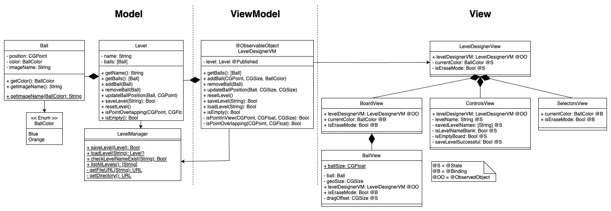
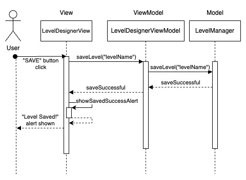

# Peggle Game iOS

## Dev Guide
### Overview
The app starts off in the LevelDesignerView. Interactions such as tapping on the board to place a peg,
dragging a peg, erasing a peg, resetting the board, saving, loading or starting a level will be handled by the 
LevelDesignerViewModel. The LevelDesignerViewModel will then call the methods provided by the models
to update the state of the models or perform file storage.

When level is started, the view navigates to the GameView which observes the GameViewModel. The GameViewModel
contains a GameEngine that implements the game loop and does the updating of the models with respect to time
The GameEngine interacts with the PhysicsEngine to get the updated position and direction of the ball and 
to handle collisions.

### Persistence
Persistence is currently handled by encoding and decoding the Level object and storing it as a json file.

### Class Diagram

The app is using a MVVM architecture. 
The game also using the game loop that runs inside the Game Engine.
The Game Engine updates the game objects using the Physics Engine

### Models
GameEngine implements the game loop and uses the functions provided by the PhysicsEngine and it 
is trying to update the state of the ball and pegs according to their current state.
PhysicsEngine simulates kinematics for regular ball movement, ball collision with the wall,
ball collision with pegs and ball position to detect stuck ball.

The peg model contains the information and the logic for handling the peg's information

There is s StaticBody protocol that specific shaped static body can conform to and
belong to static game objects (like pegs)
Currently the game pegs conform to this protocol but it is possible that there are more static bodies
such as rectangular ones in the future

The ball model contains the information and the logic for handling the ball's information

There is a BallPhysicsBody that game balls that are shot can contain in order to handle the ball
physics of the ball object

The level is being modelled in the level class which stores the Pegs and other required information

Persistence is being modelled in the Saveable protocol which is currently using the Codable protocol
to store the level data by encoding and decoding into json files

### Views
There are 2 main views now which are the LevelDesignerView and the GameView.
The LevelDesignerView contains the other subviews such as the ControlsView where there are 
the buttons such as load and save and the level name text input, the BoardView which is where the pegs
are placed and the SelectorsView to choose the current peg to place

The GameView is the view where the gameplay happens and it contains the pegs in the form of 
a GamePegView and the BallView which represents the ball

### ViewModels
There are 2 main view models now which are the LevelDesignerViewModel and the GameViewModel.

The LevelDesignerViewModel helps to control the view based on the interactions with the LevelDesignerView and 
update the state of the models using their methods. 
It contains methods to facilitate file storage too for saving and loading levels

The GameViewModel contains a Level object and a GameEngine that runs the game loop and updates all the elements in 
the game such as the ball movement, collisions and bouncing.

### Sequence diagram

The user interacts with the view through some taps or drags, which is passed on from the view to the viewmodel.
The view model handles the action, then appropriately chooses what model to update, then passes the updates
of the model to the view to be rendered. In this case, the action is the saving of the level and the model here is
the LevelManager.

## Tests
Same tests as used in the leveldesigner

### Unit Tests

#### BallPhysicsBody

- Calling reverseVx should turn the dx in the vector from + to - or vice versa
- Calling reverseVy should turn the dy in the vector from + to - or vice versa 

#### CircleStaticBody

- updatePosition should update the position with the corresponding x and y movements
- updatePosition with input 0 should cause no change to the position of the object
- getIfMoved should return a new CircleStaticBody with the updated position that is not the same reference as the original
- getIfMoved with input 0 return CircleStaticBody with the same properties but just a difference reference
- isOverlapping with its own self should return true
- when isOverlapping is called with CircleStaticBody whos square border overlap but the actual circle area do not, it should return false

#### PhysicsEngine
- getInitialVelocity should return a velocity vectore based off the angle from  the touch to the cannon.
- getInitialVelocity should return the same velocity vector if the angle is the same regardless of how far it is from the cannon
- updateBallBounceWithWall should modify the vector velocity of the ball if the ball is in contact with the top wall and reverse the dy property of the vector and, in contact with the side wall, reverse the dx property of the vector

#### GameEngine
- checkBallOut should return true if any part of the ball touches the lower edge

#### Ball
- calling reverseVx should cause the direction of the velocity in the x direction to be opposite
- calling reverseVy should cause the direction of the velocity in the y direction to be opposite

### Integration Tests

#### Level Designer
- Pegs should be placed when it does not overlap with other pegs and not obstructed by the wall or the cannon in any amount
- Pegs should be allowed to be dragged to another position when it does not overlap with other pegs and not obstructed by the wall or the cannon in any amount 
- If pegs are dragged to an illegal position, it should return to its original legal position
- Pegs should be able to almost touch each other to ensure that pegs can be tightly packed

- When load button is pressed and a level is selected, current level should be replaced with the loaded level
- When save button is pressed, empty level name should show an alert
- When save button is pressed, empty board with no pegs should show an alert
- When save button is pressed, existing level name should raise an alert asking if to cancel the saving or to overwrite the existing saved level
- When either save or loaded is pressed, the start button should be enabled
- When another action like placing a peg, erasing a peg or moving a peg is done after saving or laoding a level, the start button should turn from enabled to disabled
- When successfully saved level, an alert should be shown to user
- When start button is clicked, screen should be routed to game

#### Game

- When game is started with a level, level name should be displayed at the bottom
- When board is tapped and no balls are in play, a ball should be fired from the cannon
- When ball is fired, cannon should turn and aim at the direction of the shot
- When ball is in play, tapping on the board should do nothing (no firing of second ball)
- When ball is in play and hits a peg, the peg should light up if not already
- When ball is in play and hits the side or top wall, it should bounce off
- Ball should bounce off game objects in an order that obeys physics kinematics laws
- Ball should not pass through any game objects
- When ball is in play and touches the cannon, it should pass through it as though it was not there
- When ball is out of the board at the bottom edge, all lit pegs should be removed 
- Lit pegs should be removed with a fading animation
- When ball is in play and appears stuck, lit pegs should be cleared after 5 seconds since it first got stuck.
- Back button should be present and should return user to the level designer view

## Written Answers

### Design Tradeoffs
> When you are designing your system, you will inevitably run into several
> possible implementations, in which you need to choose one among all. Please
> write at least 2 such scenarios and explain the trade-offs in the choices you
> are making. Afterwards, explain what choices you choose to implement and why.
>
> For example (might not happen to you -- this is just hypothetical!), when
> implementing a certain touch gesture, you might decide to use the method
> `foo` instead of `bar`. Explain what are the advantages and disadvantages of
> using `foo` and `bar`, and why you decided to go with `foo`.

One of the design choices was to choose between making the model object inherit from 
a superclass that represents the shape of its physics body versus making it contain (composition)
a physics body in itself as a property as I did in my own app.

Pros:
- Choosing to use composition help to make it less coupled with the Physics models since we might have
more than one ball in the future or more than one model of the same shape which we would then
have to keep adding new subclasses

- Better for unit testing since we can inject a stub for this property

- Allowed to have multiple physics body in it to potentially represent different behaviours, whereas multiple
inheritances are not allowed in swift

Cons:
- It can help with code reuse since we do not have to redefine the methods to use in the physics models in our
game object class

I decided to split the GameEngine into its own class instead of having it all in the GameViewModel
as i initially had. When i first has my design, i felt that the entire game loop is the code that 
controls the view and reads and updates the model so it should be contained inside the VM. 
After, i realise that they are actually responsible for different things, and that the VM is a overall
controlling class that provides methods to the view to call when the view is interacted, so it is not
running all the time while the gameengine is running continuously and contains the different 
functionalities that updates the gameplay every frame. Having them as separate classes helps with 
Separation of Concerns and SRP.
