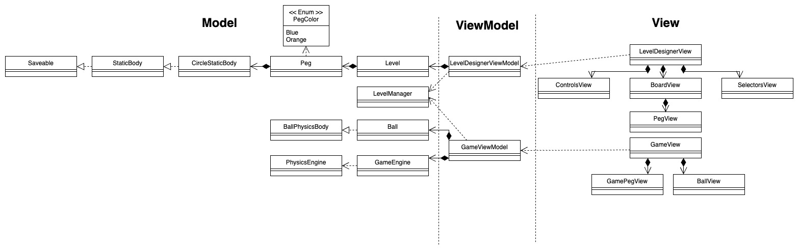

[](https://classroom.github.com/a/GTp3VxVz)
# CS3217 Problem Set 2

**Name:** Lee Hern Ping

**Matric No:** A0217990W

## Tips
1. CS3217's docs is at https://cs3217.github.io/cs3217-docs. Do visit the docs often, as
   it contains all things relevant to CS3217.
2. A Swiftlint configuration file is provided for you. It is recommended for you
   to use Swiftlint and follow this configuration. We opted in all rules and
   then slowly removed some rules we found unwieldy; as such, if you discover
   any rule that you think should be added/removed, do notify the teaching staff
   and we will consider changing it!

   In addition, keep in mind that, ultimately, this tool is only a guideline;
   some exceptions may be made as long as code quality is not compromised.
3. Do not burn out. Have fun!

## Notes
SwiftLint disabled rules:

- `conditional_returns_on_newline`: 
I feel that 
```
        guard isPointInView(position, ballSize: BallView.ballSize, in: size) else { return }
        guard !isPointOverlapping(position, ballSize: BallView.ballSize) else { return }
```
is easier to parse than
```
        guard isPointInView(position, ballSize: BallView.ballSize, in: size) else { 
            return
        }

        guard !isPointOverlapping(position, ballSize: BallView.ballSize) else { 
            return 
        }
```

- `file_name`:
I use XXXEnum.swift to name my enum files but the enums themselves are just named XXX
 
- `vertical_whitespace`:
I use 2 newlines between my functions for readability

- `implicit_return`
Even if it is a one statement function, seeing the word 'return' helps with readability


## Dev Guide

### Class Diagram


### Model

#### 1. Ball

Ball model is used to represent the balls that can be placed on the level designer game. 
It stores information about color, position and image resource name

#### 2. Level

Level model is used to represent the entire level that is designed.
It stores information about the balls placed and the level name


#### 3. LevelManager

LevelManager is a utility class to help with the functionalities that interacts with the phone storage. It allows for saving, loading and getting levels


### View

#### 1. LevelDesignerView

Main view that contains 3 parts: BoardView, ControlsView, SelectorsView

#### 2. BoardView

BoardView contains the main background and the tappable area where users can tap and place balls. BoardView is also responsible for displaying the BallView

#### 3. ControlsView

ControlsView is a horizontal bar that contains the textinput to allow user to change the Level name, and 4 buttons: Save, Load, Reset and Start

#### 4. SelectorsView

SelectorsView is another horizontal bar that contains the selectors that are used in the level designer, mainly the different colored balls and the eraser tool.

### ViewModel

#### 1. LevelDesignerVM

LevelDesignerVM is the main controller that facilitates the communication between views and models and controls what happens when some action is taken by the user. It uses an Observer pattern where it allows the views to observe this class and watch for changes in the published fields.


## Tests

### Model

#### Ball
- Pass in a position and color stub, should get the same position and color using getters

- Pass in BallColor.blue, should return "ball-blue" as image name

- Pass in BallColor.orange, should return "ball-orange" as image name

#### Level
- Pass in a string and a array of balls should return the same string and same balls array 

- Use empty initialiser should return the default values for Level object

- Empty level (empty balls array) should contain one ball when addBall is called once

- One ball array should become empty when removeBall is called once

- When updateBallPosition is called, ball in array should have the corresponding new Position

- When save level is called and levelName does not exist yet, the new level name is used to save the level.

- When save level is called and levelName exist, the level is updated with the new array of balls to be saved

- When array has 0 balls, calling resetLevel should do nothing

- When array has 1 or more balls, calling resetLevel should make the array have 0 balls

- When array has 0 balls, isEmpty should return true

- When array has 1 or more balls, isEmpty should return false

- When the array has 1 ball at position X, calling isPointOverlapping with the same position should return true

- When the array has 1 ball at position X, calling isPointOverlapping with the position X + some distance < ballSize should return true for both the x and the y coordinates of the position

### View

#### SelectorsView

- When one of the options is selected, there should be a black outline showing the current selection

- WHen one of the options is selected, the other options should not be selected

- When one of the options is selected, selecting the same option should do nothing

#### ControlsView

- When the Save button is clicked, validation checks should be done
    - if level name is blank, alert should show and save should be unsuccessful (return false)
    - if level name is not blank but no balls are places, alert should show and save should be unsuccessful (return false)
    - if level name is not blank and balls are placed, save should be successful and alert should show success message

- When levelName exists, save should overwrite the currently saved data for that level

- when levelName does not exist, save should create a new entry for the level

- when Load button is clicked, menu showing list of saved levels should popup

- when a level is clicked after load button shows menu of levels, loaded level should replace the current one shown on the screen and level name should be shown

- when reset button is clicked, board should clear all balls

- when reset button is clicked, level name should reset to blank

#### BoardView
- when a ball is selected, tapping on a location on the board should show the corresponding ball being placed on the tap location

- when a touch happens too near the edges of the board (partially out of bounds), the ball should not be placed

- when a touch happens too near another ball (partially overlapping another ball), ball should not be placed

- when eraser is selected, touching an empty area should do nothing

- when eraser is selected, touching a ball should remove it

- when tap and dragging a ball to a valid location (within the board and not overlapping), the ball should move to the new location and stay, regardless of current selector

- when tap and dragging a ball to an invalid location (partially/fully outside teh board or overlapping another ball), the ball should return to its original location, regardless of current selector

- when long tapping a ball (> 0.5s), ball should be removed regardless of current selector

## Written Answers

### Design Tradeoffs
> When you are designing your system, you will inevitably run into several
> possible implementations, in which you need to choose one among all. Please
> write at least 2 such scenarios and explain the trade-offs in the choices you
> are making. Afterwards, explain what choices you choose to implement and why.
>
> For example (might not happen to you -- this is just hypothetical!), when
> implementing a certain touch gesture, you might decide to use the method
> `foo` instead of `bar`. Explain what are the advantages and disadvantages of
> using `foo` and `bar`, and why you decided to go with `foo`.

Your answer here
Since both Ball and Level are primarily data containers without complex behavior, i choose to use struct for its value type semantics and to avoid having to handle unintended mutation of its properties. There is also no need for deinitialising for structs so there is one less area where i have to handle memory leaks.


---

### Persistence Justification

#### File-Based Storage + Encoding/Decoding:
> Pros: easy to implement, easy to debug and does not require external libraries
> 
> Cons: May not be suitable or efficient for large or complex data to be stored


#### SQLite Swift:
> Pros: Better performance and scalability when using more data and more complex data, since you are able to describe and control the schema used
> 
> Cons: Requires more setup (schema, connections etc), and requires using an external database library to use in the code, and has to incorporate SQL in too.

#### Core Data
> Pros: Built into swift which provides high level API for users to interact with, provides more funcationalities of the data persistence and can handle more complex data than just using a file base storage
> 
> Cons: Harder to implement and much more complex to code.


I  used the File Based Storage system after trying to hook up core data and struggling. Currently, data is not complex and requires little memory to store so using a file based storage system is the easiest and most suitable for now. If more complex or more volume of data is required to be stored, I will consider the change to using either sqlite or coredata.
